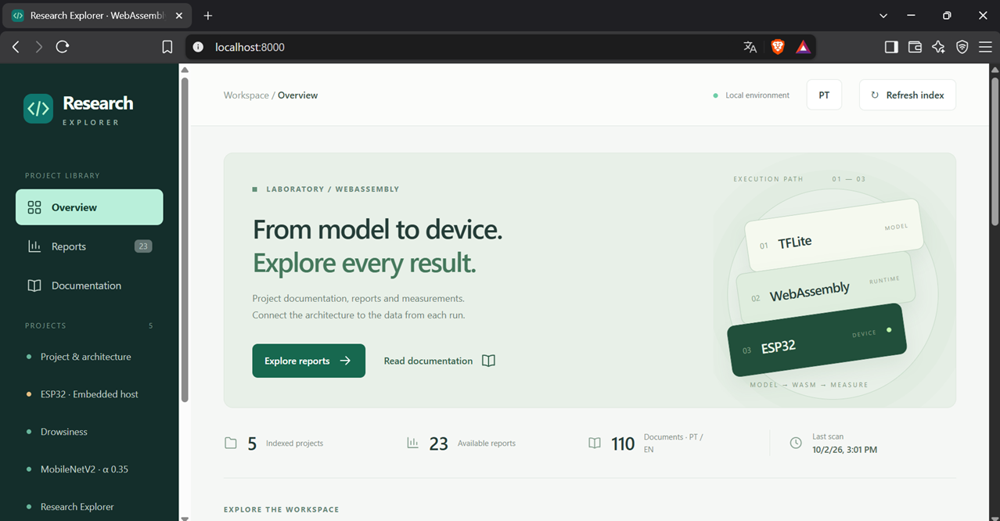

[English](README.md) | [Português (Brasil)](README.pt-BR.md)

# TFLite → WAT/WASM com pacotes de modelo

## Do modelo ao dispositivo

Explore uma rede neural quantizada desde sua representação TFLite até a execução em WebAssembly, inspecione os resultados e estude a inferência embarcada no ESP32. Este repositório reúne um pipeline Python, dois pacotes de modelo, um host ESP32 independente e um site local para consultar documentação e medições.

[](web/README.pt-BR.md)

*O Research Explorer reúne os projetos em uma biblioteca local. As contagens da imagem representam o estado do repositório no momento da captura.*

## O que cada projeto oferece

| Projeto | O que você pode fazer | Por onde começar |
|---|---|---|
| Python · TFLite → WAT/WASM | Extrair grafos compatíveis, pesos e quantização; inspecionar a alocação de memória; gerar e compilar WAT; executar imagens RAW com Wasmtime e produzir relatórios. | [Fluxo completo](docs/12-fluxo-completo.pt-BR.md) |
| Drowsiness | Estudar classificação binária com entrada RGB565, inspecionar predições e compará-las com os rótulos conhecidos. | [Pacote do modelo](models/drowsiness/README.pt-BR.md) |
| MobileNetV2 Alpha 0.35 | Explorar classificação ImageNet com entrada BGR888 e inspecionar as 15 classes mais prováveis do exemplo incluído. | [Pacote do modelo](models/mobilenetv2_alpha035/README.pt-BR.md) |
| Host ESP32 | Executar um módulo WASM/AOT compatível, baixar imagens do Cloudinary e coletar predições, tempos de inferência/download e medições de memória em um relatório CSV. | [Guia do host](ESP32/cnn_webassembly_esp32/README.pt-BR.md) · [AOT com WSL](ESP32/cnn_webassembly_esp32/README_AOT_WSL.pt-BR.md) |
| Research Explorer | Navegar por projetos, ler Markdown em português/inglês, buscar e ordenar tabelas, consultar gráficos de tempo/memória e baixar os arquivos originais. | [Guia do site](web/README.pt-BR.md) |

O host ESP32 é configurado e compilado independentemente do pipeline Python. O site consulta arquivos existentes; ele não executa inferências nem busca relatórios no dispositivo. Os operadores suportados e o contrato entre host e módulo determinam quais modelos podem ser executados.

## Sobre o pipeline

Este projeto extrai redes quantizadas compatíveis de arquivos TFLite, organiza grafo, pesos, quantização e memória, materializa um template WAT e compila um módulo WASM. Depois executa imagens RAW com Wasmtime e grava resultados por modelo. O objetivo é estudar e inspecionar a tradução para um runtime WebAssembly próprio, incluindo reutilização de slots e contrato binário entre Python e kernels.

Há dois pacotes: **drowsiness**, classificação binária de sonolência com RAW RGB565, e **mobilenetv2_alpha035**, classificação ImageNet Top-15 com RAW BGR888. Cada um possui `model.toml`, TFLite, testes e destinos independentes. O projeto não é um conversor universal de qualquer TFLite; as restrições estão descritas abaixo e na documentação técnica.

**Comece pelo [índice técnico](docs/README.pt-BR.md)**. Ele reúne arquitetura, APIs de cada módulo, contrato de 29 campos, modelos, tutorial e limitações. Os textos anteriores foram preservados em `docs/historico/`.

O [host ESP32](ESP32/cnn_webassembly_esp32/README.pt-BR.md) é independente do pipeline Python. Consulte o [guia AOT usando WSL](ESP32/cnn_webassembly_esp32/README_AOT_WSL.pt-BR.md) e a [referência de configuração do host](ESP32/cnn_webassembly_esp32/HOST.pt-BR.md).

## Consultar documentação e relatórios

O [host TFLite Micro no ESP32](ESP32/cnn_tflite_esp32/README.pt-BR.md) executa o modelo original na placa e exporta medições CSV para comparar com o firmware WASM/AOT separado.

Execute `python web/server/app.py` na raiz e abra **http://127.0.0.1:8000**. O [Research Explorer](web/README.pt-BR.md) organiza Markdown e relatórios por projeto, com gráficos, tabelas pesquisáveis e navegação entre idiomas. Basta Python 3.10+; não precisa instalar as dependências de inferência.

## Instalação

Para executar os modelos TFLite originais e comparar depois com o WASM, use o [runner TFLite separado](docs/15-referencia-tflite.pt-BR.md): instale `requirements-tflite.txt` em um ambiente próprio e execute `python run_tflite.py`. Os relatórios ficam em `models/<modelo>/reports_tflite/<data-hora>/`, sem substituir os relatórios WASM.

Requer Python 3.10+ disponível no sistema. Na raiz do repositório, em PowerShell:

```powershell
python -m venv .venv
.\.venv\Scripts\Activate.ps1
python -m pip install -r requirements.txt
```

Em shell POSIX, a ativação equivalente é `source .venv/bin/activate`. O script `setup_env.ps1` também cria/ativa `.venv` e instala dependências, mas não repara uma venv existente que aponte para Python removido. Nesta máquina, as verificações usaram `.venv-models/Scripts/python.exe`; `.venv` é um ambiente antigo com interpretador de origem ausente. Ambientes virtuais não substituem a instalação de um Python válido em outra máquina.

| Dependência | Versão declarada | Responsabilidade |
|---|---|---|
| flatbuffers | 25.12.19 | Acesso ao formato FlatBuffer |
| numpy | 2.2.6 | Arrays, bytes, quantização e ranking |
| tflite | 2.18.0 | Bindings do schema; não é o interpretador TensorFlow |
| wasmtime | >=49,<50 | WAT→WASM e execução do binário |
| tomli | >=2,<3, apenas Python<3.11 | Parser TOML; em 3.11+ usa tomllib |

Não é necessário instalar o executável WABT `wat2wasm`: o compilador chama `wasmtime.wat2wasm` pela API Python.

## Comandos

```powershell
python main.py --list-models
python main.py
python main.py --model drowsiness
python main.py --model mobilenetv2_alpha035
python -m unittest discover -s tests -v
```

Sem `--model`, executa drowsiness. A listagem mostra nome da pasta e descrição do manifest. A CLI não possui modo de somente compilação nem filtro de casos: o fluxo completo descobre testes, extrai, gera, compila e infere. Use o nome de uma pasta em `models/`, não o caminho direto de um TFLite.

## Arquitetura completa

```text
                         USUÁRIO
                            │
                            ▼
               python main.py --model X
                            │
                            ▼
               ModelPackage / ModelConfig
                    models/X/model.toml
                            │
           ┌────────────────┼───────────────────┐
           ▼                ▼                   ▼
      TFLite original   template WAT      configuração de teste
           │                │                   │
           ▼                │                   ▼
     ModelPipeline          │              registry.py
           │                │                   │
           │ valida fontes e descobre casos ◄── adapter
           ▼                │                   │
        EXTRACTOR           │                   │
           ├── grafo / slots / tensor→slot       │
           ├── pesos / quantização / memória    │
           └── LayerParams / params_blob        │
           │                │                   │
           └───────┬────────┘                   │
                   ▼                            │
             wat_generator                      │
                   ▼                            │
       models/X/generated/model.wat             │
                   ▼                            │
        wasmtime.wat2wasm (compilação)           │
                   ▼                            │
       models/X/generated/model.wasm            │
                   └───────────┬────────────────┘
                               ▼
                    inference/wasm_inference.py
                               │
           prepare_input → memory.write → run → memory.read
                               │
                     evaluate_output por caso
                               ▼
                    build_report + lista de erros
                               ▼
                models/X/reports/<timestamp>/12-inferencia-wasm.txt
```

Entram o nome do pacote, suas fontes e os testes. `ModelPipeline` transforma os dados do TFLite em estruturas do runtime e coordena os dois ramos. Saem WAT, WASM e relatórios. Caminhos, classes, formato e pesos são específicos do modelo; serialização, alocação e protocolo de execução são compartilhados. Os relatórios 02–11 são gravados durante a extração, antes da inferência; a posição de `reports/` ao final não significa uma gravação única.

## Árvore do repositório

```text
master-degree-project/
├── main.py                         CLI
├── requirements.txt                dependências Python
├── setup_env.ps1                    criação/ativação de .venv
├── README.md
├── .gitignore
├── adapters/                       base, binary_folders, imagenet_topk, registry
├── extractor/                      15 arquivos Python, incluindo __init__.py
├── inference/
│   └── wasm_inference.py            host Wasmtime
├── pipeline/                       config, package, pipeline, compiler
├── models/
│   ├── drowsiness/
│   │   ├── model.toml
│   │   ├── model_int8_esp32.tflite
│   │   ├── test/{drowsy,non_drowsy}/
│   │   ├── generated/{model.wat,model.wasm}
│   │   └── reports/                11 relatórios
│   └── mobilenetv2_alpha035/
│       ├── model.toml
│       ├── mobilenetv2_alpha035_quant.tflite
│       ├── labels/imagenet_class_index.json
│       ├── test/img/aviao_uint8.raw
│       ├── wat/model_template.wat
│       ├── generated/{model.wat,model.wasm}
│       └── reports/                11 relatórios
├── img_mobilenetv2/aviao_uint8.raw   cópia fora do pacote
├── wat/templates/
│   ├── mobilenet_int8_v1.wat        selecionado por drowsiness
│   └── model_template.wat          legado, sem manifest apontando para ele
├── tests/test_model_packages.py
├── docs/                           referência atual e material histórico
├── .venv/                          ambiente local antigo
├── .venv-models/                    ambiente usado nas verificações
└── __pycache__/                    cache local; também existe em módulos
```

Esta árvore agrupa arquivos repetitivos; o [inventário](docs/14-inventario-e-rastreabilidade.pt-BR.md) relaciona cada módulo e os conjuntos de dados. Entra a configuração de cada diretório `models/`; o pipeline lê suas fontes e escreve nas duas pastas de artefatos. `img_mobilenetv2/` não é consultado pelo manifesto atual. `.git/`, caches e ambientes são infraestrutura local, não parte do runtime gerado.

## Conceitos de uso

**TFLite** é a fonte FlatBuffer com operadores/tensores. **WAT** é o texto WebAssembly produzido a partir de um template mais os dados extraídos. **WASM** é o binário compilado. A rede executa os kernels do template, não um interpretador TFLite embutido.

**ModelPackage** agrupa root/config e resolve fontes/destinos. **model.toml** declara `model.name`, `model.tflite`, contrato/template/slots, formato/camada sintética e o adapter de testes. Caminhos nos manifests atuais são relativos à pasta do pacote; o resolvedor também permite caminhos absolutos. Veja a [referência campo por campo](docs/03-model-config-manifesto.pt-BR.md).

**Adapter** prepara arquivos e interpreta saídas pela interface TestAdapter. `binary-folders` associa labels a pastas e calcula acurácia; `imagenet-topk` troca BGR→RGB, dequantiza e apresenta classes/wnid/scores. Seleção é feita pelo registry usando `test.adapter`.

**synthetic_layer** representa uma operação inserida pelo extrator que não pertence ao grafo TFLite original. `rgb565_to_rgb888` acrescenta um kernel SLOT0→SLOT1 e shift de slots 1. `none` não insere kernel, com shift 0; o adapter prepara a entrada. Veja os [diagramas das duas variantes](docs/09-modelos-e-pacotes.pt-BR.md).

**layerparam-v1** é o nome do ABI, não um arquivo: cada camada é serializada em 29 int32 little-endian, total 116 bytes, lidos por offsets fixos no WAT. O template deve respeitar códigos de operações, flags, campos e exports. Trocar somente o caminho do template não assegura compatibilidade. Consulte a [tabela completa](docs/08-contrato-layerparam-v1.pt-BR.md).

## Saídas, relatórios e fontes

O pipeline escreve `models/<nome>/generated/model.wat` e `model.wasm`. Cada execução salva todos os relatórios 02–12 em uma nova pasta, `models/<nome>/reports/<timestamp>/`, por exemplo `20261006T234046384562Z` (UTC, com microssegundos). Os relatórios anteriores são preservados. Execuções com falha podem deixar uma pasta de relatórios incompleta. Os arquivos WAT/WASM em `generated/` continuam sendo substituídos a cada execução.

Templates ativos: `wat/templates/mobilenet_int8_v1.wat` para sonolência e `models/mobilenetv2_alpha035/wat/model_template.wat` para ImageNet. O arquivo `wat/templates/model_template.wat` é legado, não selecionado pelos manifests e com comportamento antigo de QUANTIZE.

| Pacote | Entrada host | Saída | Evidência nos relatórios existentes |
|---|---|---|---|
| [drowsiness](models/drowsiness/README.pt-BR.md) | 128×128 RGB565, 32768 bytes | 2 classes UINT8 | 1965/2000 acertos; 98,25%; 5 inválidos; 0 erros |
| [mobilenetv2_alpha035](models/mobilenetv2_alpha035/README.pt-BR.md) | 224×224 BGR888, 150528 bytes | 1000 classes, Top-15 | Um RAW; primeiro: airliner, q=226, score=0,8828125 |

Esses números são observações do runtime e dados presentes, não validação de equivalência completa com TFLite nem de desempenho em dados novos. Scores são valores dequantizados; não são apresentados como probabilidades calibradas.

## Adicionar um terceiro modelo

1. Crie `models/<nome>/` com TFLite e `model.toml`.
2. Confirme shapes/dtypes/opcodes e selecione template compatível com layerparam-v1.
3. Configure formato e sintética; escolha adapter e prepare RAWs não vazios.
4. Configure ordem das classes ou labels por índice.
5. Execute `python main.py --model <nome>` e inspecione relatórios/intermediários.

O [tutorial detalhado](docs/10-como-adicionar-modelo.pt-BR.md) inclui um comando de inspeção do TFLite, árvore e condições em que cadastro não basta. Novos adapters exigem implementar a interface e registrar uma classe; novos operadores exigem também extrator/kernel/contrato adequados.

## Limitações atuais

O fluxo aceita uma entrada e saída de 8 bits, entrada NHWC batch 1 com três canais e exatamente três slots. Kernels cobrem CONV_2D, DEPTHWISE_CONV_2D, FULLY_CONNECTED, ADD, MEAN, SOFTMAX, QUANTIZE e a sintética RGB565, com restrições: depthwise presume multiplicador 1; MEAN é espacial; ADD não faz broadcasting; certas ativações fundidas não são aplicadas. O softmax WAT usa multiplicador fixo, apesar de Python extrair parâmetros por modelo. Operadores desconhecidos podem ser pulados pelo builder, por isso compilação bem-sucedida não comprova cobertura da rede.

Há sete testes direcionados, incluindo um kernel QUANTIZE real em WASM; não existe comparação automática completa com um interpretador TFLite. Não há treinamento, preprocessamento de imagens comprimidas, múltiplos outputs, timeout por inferência ou integração de execução em hardware no fluxo atual. Leia o [registro de inconsistências e limitações](docs/99-inconsistencias-e-limitacoes.pt-BR.md) antes de ampliar o escopo.

## Idiomas da documentação

As páginas em inglês usam `.md`; suas correspondentes em português brasileiro usam `.pt-BR.md`. Atualize os dois idiomas ao alterar a documentação. Preserve comandos, identificadores, nomes de arquivos e exemplos executáveis, além dos avisos dos documentos históricos. Consulte as [orientações de contribuição](CONTRIBUTING.pt-BR.md).
